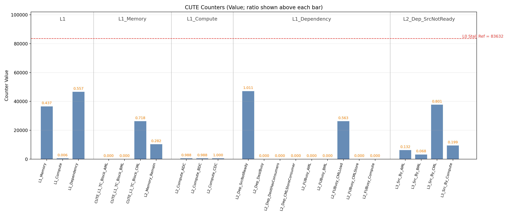

# TMA-toolkit (Top-down Micro-architecture Analysis)

Chinese version: [README.zh-CN.md](README.zh-CN.md)

`tools/TMA-toolkit` is a YAML-driven, module-agnostic performance analysis toolkit:
- `apply`: insert/refresh `XSPerfAccumulate(...)` counters from preset
- `report`: parse simulation log and generate `CSV/PNG/MD/JSON/RPT`

## Infrastructure Value

Without infrastructure, teams usually add `XSPerfAccumulate(...)` directly in RTL. That is fast short-term but expensive long-term:

- Counter code remains in branches or mainline and keeps accumulating.
- Different developers define different semantics, so results are hard to compare.
- Temporary probes are easy to forget/remove incorrectly.
- Code review gets noisy with observation-only edits.

This toolkit moves observation semantics to YAML presets:

- Single source of truth: counters, hierarchy, formulas, chart groups, checks.
- Apply on demand: instrument only when needed.
- Idempotent automation: stable insertion/replacement behavior.
- Reproducible report: same preset + same log => same results.

## Background and Goal

Top-down analysis attributes total stall layer by layer:

1. L1 major class: `Memory / Compute / Dependency`
2. L2 subcause: e.g. specific SB dependency/resource reason
3. L3 source: e.g. producer side `AML/BML/CML/Compute`

The engineering target is to answer bottleneck questions quickly with reproducible data, by changing preset YAML instead of changing toolkit code.

## Toolkit Responsibilities

- `tma.py`: CLI entry
- `tma_apply.py`: instrumentation engine
- `tma_report.py`: parsing, formulas, consistency checks, charting, `.rpt`
- `presets/<module>/<preset>.yaml`: module-specific instrumentation + analysis
- `reports/`: archived outputs
- `examples/`: one teaching demo bundle

Default preset:

- `cute/default`: exclusive L1 `Memory/Compute/Dependency`

## Preset Format

TMA-toolkit instrumentation schema:

- `instrumentation.sites`: where to insert counters (file/anchor/indent/import/block id)
- `instrumentation.points`: what to count (`name`, `site`, `expr`)

Define `instrumentation` with `sites + points`, and keep module customization in this structure.

## Make Targets (Recommended Entry)

Use Make targets as the primary interface for daily work:

| Target | Purpose | Key inputs | Exit behavior | Output location |
| --- | --- | --- | --- | --- |
| `sync` | Install/update Python dependencies from `uv.lock` | none | non-zero on failure | local `.venv` |
| `list-presets` | List available preset ids | none | always zero | stdout |
| `show-vars` | Print resolved variables/paths for debug | optional vars | always zero | stdout |
| `apply-dry` | Preview instrumentation changes and anchor match | `PRESET`, `BASELINE_REF`, `REPO_ROOT` | non-zero on failure | stdout summary/diff |
| `apply` | Write instrumentation into RTL | `PRESET`, `BASELINE_REF`, `REPO_ROOT` | non-zero on failure | RTL files |
| `report` | Generate archive report in tolerant mode | `PRESET`, `LOG`, `OUT_ROOT`, `RUN_ID`, `BACKUP_LOG` | always zero (`|| true`) | `reports/<module>/<preset>/<run-id>/` |
| `report-strict` | Generate archive report in gate mode | same as `report` | non-zero on strict/check failure | same as `report` |
| `report-prefix` | Generate prefix-mode report in tolerant mode | `PRESET`, `LOG`, `OUT_PREFIX` | always zero (`|| true`) | `<OUT_PREFIX>_*` |
| `report-prefix-strict` | Generate prefix-mode report in gate mode | `PRESET`, `LOG`, `OUT_PREFIX` | non-zero on strict/check failure | `<OUT_PREFIX>_*` |
| `report-no-backup` | Archive report without `input.log` backup | `PRESET`, `LOG`, `OUT_ROOT` | always zero (`|| true`) | archive dir |
| `report-no-backup-strict` | Strict archive report without `input.log` backup | `PRESET`, `LOG`, `OUT_ROOT` | non-zero on strict/check failure | archive dir |
| `demo` | Rebuild repository teaching demo | none | always zero (`|| true`) | `examples/tma-cute_*` |
| `demo-strict` | Strict rebuild of teaching demo | none | non-zero on strict/check failure | `examples/tma-cute_*` |

## Full Workflow (`cute/default`)

### 1) Environment

```bash
curl -LsSf https://astral.sh/uv/install.sh | sh
export PATH="$HOME/.local/bin:$PATH"
uv sync --project tools/TMA-toolkit
```

### 2) List presets

```bash
make -C tools/TMA-toolkit list-presets
```

### 3) Apply instrumentation

Preview changes and validate anchors:

```bash
make -C tools/TMA-toolkit apply-dry PRESET=cute/default
```

Write instrumentation into RTL:

```bash
make -C tools/TMA-toolkit apply PRESET=cute/default
```

Optional debug (resolved paths/vars):

```bash
make -C tools/TMA-toolkit show-vars PRESET=cute/default LOG=log/emu-error.log
```

### 4) Run simulation

```bash
make run-emu PAYLOAD=<your-payload>
```

### 5) Generate report

Archive mode, tolerant (always exits zero):

```bash
make -C tools/TMA-toolkit report PRESET=cute/default LOG=log/emu-error.log
```

Archive mode, strict gate:

```bash
make -C tools/TMA-toolkit report-strict PRESET=cute/default LOG=log/emu-error.log
```

Prefix mode to write into `log/`:

```bash
make -C tools/TMA-toolkit report-prefix PRESET=cute/default LOG=log/emu-error.log OUT_PREFIX=log/tma-cute
```

### 6) Output files

Archive path:

```text
tools/TMA-toolkit/reports/<module>/<preset>/<run-id>/
```

Core artifacts:

- `values.csv`: direct + derived + parent ratios
- `combined.png`: grouped bars + baseline reference line
- `report.md`: human summary
- `report.rpt`: structured machine-readable report
- `consistency.json`: check results
- `input.log`: backed up input log
- `run_meta.json`: run metadata

## Example / Demo (Single Teaching Bundle)

The repository contains one reproducible teaching example in flat `examples/`:

- `examples/emu-error.default.log` (trimmed to `cute/default` direct counters only)
- `examples/tma-cute_values.csv`
- `examples/tma-cute_combined.png`
- `examples/tma-cute_report.md`
- `examples/tma-cute_consistency.json`
- `examples/tma-cute_report.rpt`

Reproduce the demo bundle:

```bash
make -C tools/TMA-toolkit demo
```

Note: `make ... demo` is tolerant and returns zero. Use `make ... demo-strict` for gate behavior.

Demo chart:



Expected key results (from `examples/tma-cute_values.csv`):

- `CUTE_L0_TC_Stall = 83632`
- `L1_Memory = 36537 (43.69% of L0)`
- `L1_Compute = 521 (0.62% of L0)`
- `L1_Dependency = 46574 (55.69% of L0)`
- `L2_Dep_SrcNotReady = 47095`
- `L2_Res_CMLLoadBusy = 26232`
- `L3_Src_By_CML = 37717`

Consistency summary (from `examples/tma-cute_consistency.json`):

- `l1_sum_eq_l0_stall`: PASS
- `l2_sum_eq_l1_dependency`: FAIL (`73327 != 46574`)

## Top-down Reading Guide

Suggested order:

1. Ratio first
2. Absolute value second
3. Consistency checks last

L0 baseline:

- baseline is `CUTE_L0_TC_Stall` (dashed line `L0 Stall Ref`)

L1 major causes:

- `CUTE_L1_TC_Stall_Memory`
- `CUTE_L1_TC_Stall_Compute`
- `CUTE_L1_TC_Stall_Dependency`

L1 Memory children:

- `CUTE_L1_TC_Block_AML`
- `CUTE_L1_TC_Block_BML`
- `CUTE_L1_TC_Block_CML`
- `CUTE_L2_Memory_Remain` (residual bucket)

L1 Compute children:

- `CUTE_L1_TC_Block_ADC`
- `CUTE_L1_TC_Block_BDC`
- `CUTE_L1_TC_Block_CDC`

L1 Dependency children (L2):

- Dependency class: `SrcNotReady / DestBusy / DestHasConsumers / CMLStoreConsumer`
- Resource class: `AMLBusy / BMLBusy / CMLLoadBusy / CMLStoreBusy / ComputeBusy`

L3 source split:

- `SrcNotReady_By_AML/BML/CML/Compute`

## Troubleshooting

`matplotlib` missing:

- Symptom: `[ERROR] matplotlib is not installed`
- Action: `uv sync --project tools/TMA-toolkit`

`report-strict` failed:

- Symptom: non-zero exit
- Action: inspect `consistency.json` and check preset semantics/domain closure.
- Note: `make report` is tolerant; `make report-strict` is gate mode.

`apply` anchor mismatch:

- Symptom: `missing_anchors` in output
- Action: update preset `anchor_regex` to match current RTL, do not patch inserted blocks manually.

Output path confusion:

- No `--out-prefix`: outputs go to `tools/TMA-toolkit/reports/...`
- With `--out-prefix`: outputs go next to that prefix.

## Extend to New Module (YAML-only)

1. Add `presets/<module>/<preset>.yaml`
2. Define `instrumentation` and `analysis`
3. Run `apply` and `report`

```bash
make -C tools/TMA-toolkit apply PRESET=<module>/<preset>
make -C tools/TMA-toolkit report PRESET=<module>/<preset> LOG=<log>
```

Rule:

- Keep toolkit generic.
- Encode module differences in preset YAML.
- Do not hand-maintain permanent instrumentation blocks in RTL.

## Command Quick Reference

```bash
make -C tools/TMA-toolkit sync
make -C tools/TMA-toolkit list-presets
make -C tools/TMA-toolkit show-vars PRESET=cute/default LOG=log/emu-error.log
make -C tools/TMA-toolkit apply PRESET=cute/default
make -C tools/TMA-toolkit apply-dry PRESET=cute/default
make -C tools/TMA-toolkit report PRESET=cute/default LOG=log/emu-error.log
make -C tools/TMA-toolkit report-strict PRESET=cute/default LOG=log/emu-error.log
make -C tools/TMA-toolkit report-prefix PRESET=cute/default LOG=log/emu-error.log OUT_PREFIX=log/tma-cute
make -C tools/TMA-toolkit report-prefix-strict PRESET=cute/default LOG=log/emu-error.log OUT_PREFIX=log/tma-cute
make -C tools/TMA-toolkit report-no-backup PRESET=cute/default LOG=log/emu-error.log
make -C tools/TMA-toolkit demo
```
